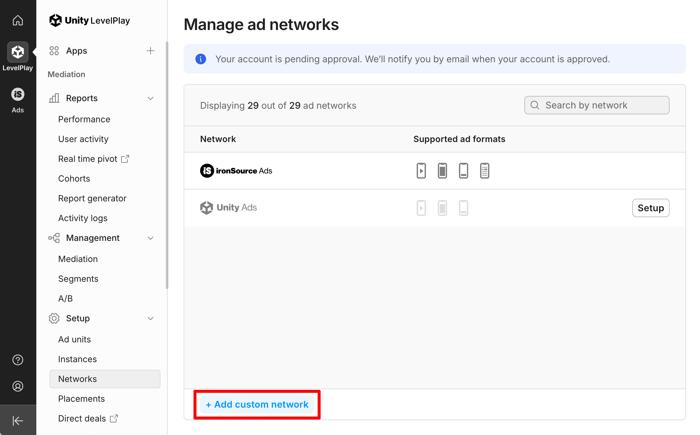
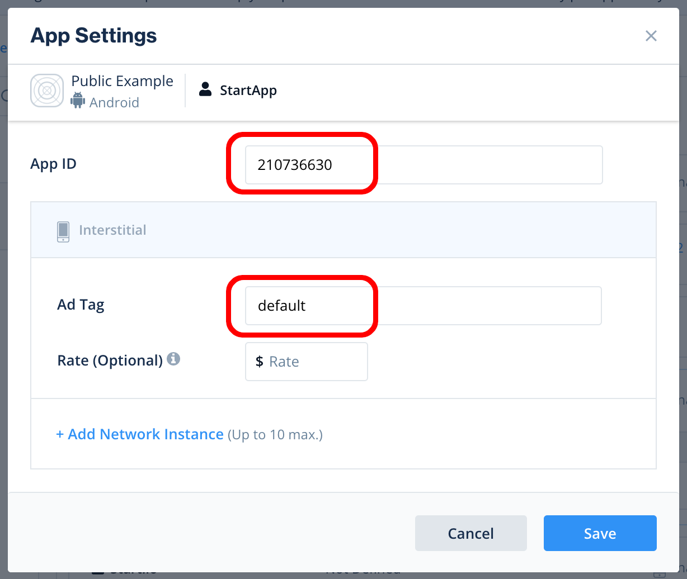
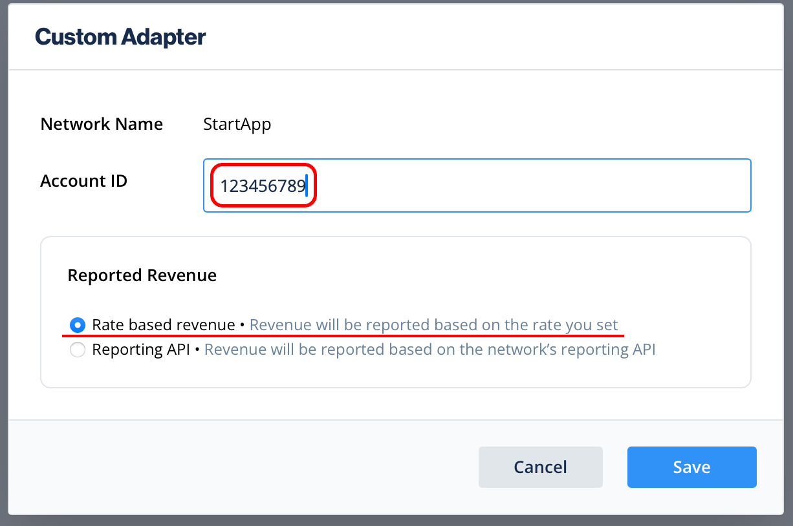

# Start.io Mediation Adapter for IronSource (Android)

## Setup Start.io

1. [Open a Publisher account][1]
2. [Add an App][2]
3. Make sure you find an **Account ID** and **App ID**


## Setup IronSource

**IMPORTANT**: Because IronSource Custom Adapters is still in beta-testing phase,
you should [contact IronSource support][5] and ask them to enable Custom Adapters for your app.

4. Register **Start.Io** [custom adapter][3] for your IronSource account



Network key: **15b99c96d**


Сlick “Enter key” and save (image above)


Set your Account ID, choose "Rate base revenue" and save (image above)


5. Field **Ad Tag** is mandatory, but if you don't want to use it, you can set value **default**.



## Setup project

6. Add dependency on Start.Io IronSource Mediation library

```
dependencies {
    // noinspection GradleDependency
    implementation 'com.startapp:ironsource-mediation:1.+'
}
```

## Testing

7. Use your IronSource **App Key** with this demo project. Put your value on [this line][4] then compile and launch.



 [1]: https://support.start.io/hc/en-us/articles/202766673
 [2]: https://support.start.io/hc/en-us/articles/202766743
 [3]: https://developers.is.com/ironsource-mobile/general/custom-adapter-setup
 [4]: https://github.com/StartApp-SDK/ironsource-mediation/blob/7f9fd526375f8f6a3da6fd2945c81460a7b36cd9/Android/Java/app/src/main/java/com/ironsource/ironsourcesdkdemo/DemoActivity.java#L37
 [5]: https://ironsrc.formtitan.com/contact-us
