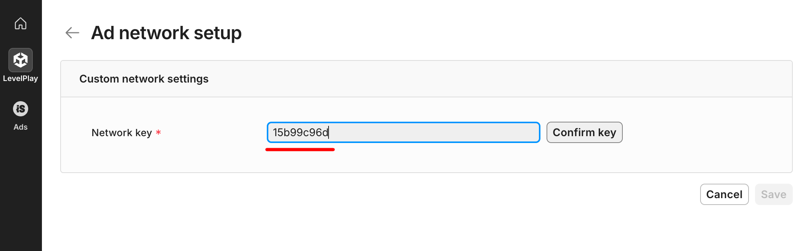
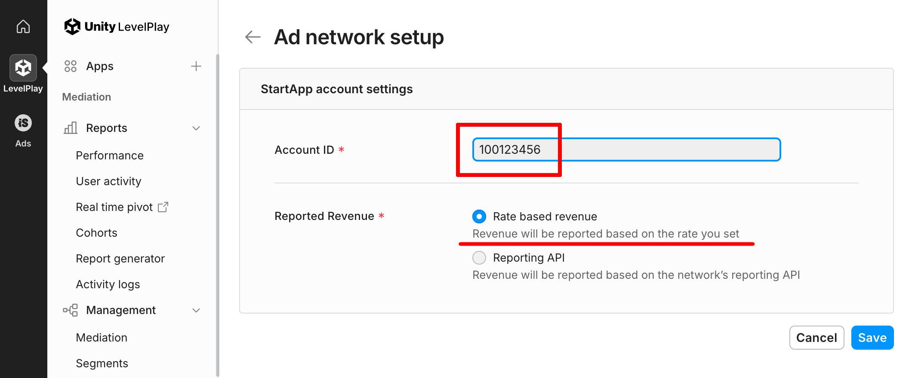

# Start.io Mediation Adapter for IronSource (Android)

## Setup Start.io

1. [Open a Publisher account][1]
2. [Add an App][2]
3. Make sure you find an **Account ID** and **App ID**
   

## Setup project

4. Add dependency on Start.Io IronSource Mediation library

If your project depends on `com.ironsource.sdk:mediationsdk` then use:

```
dependencies {
    // noinspection GradleDependency
    implementation 'com.startapp:ironsource-mediation:2.+'
}
```

If your project depends on `com.unity3d.ads-mediation:mediation-sdk` then use:

```
dependencies {
    // noinspection GradleDependency
    implementation 'com.startapp:unity-ads-mediation:2.+'
}
```

## Setup IronSource

5. Register **Start.Io** [custom adapter][3] for your IronSource account.

Use network key value: `15b99c96d`




6. Set your Account ID, choose "Rate base revenue" and save.



7. Set your App ID, fields **Instance name** and **Ad Tag**. These fields are mandatory, but if you don't want to use it, you can use value **default** for them.


## Testing

8. The [demo app](/example) is fully workable. Change ad unit IDs in [ad_ids.xml](/example/src/main/res/values/ad_ids.xml), then build and run the app to make sure your integration is working correctly.

Old demo project is available in branch [legacy](https://github.com/StartApp-SDK/android-ironsource-mediation/tree/legacy).

[1]: https://support.start.io/hc/en-us/articles/202766673
[2]: https://support.start.io/hc/en-us/articles/202766743
[3]: https://developers.is.com/ironsource-mobile/general/custom-adapter-setup
